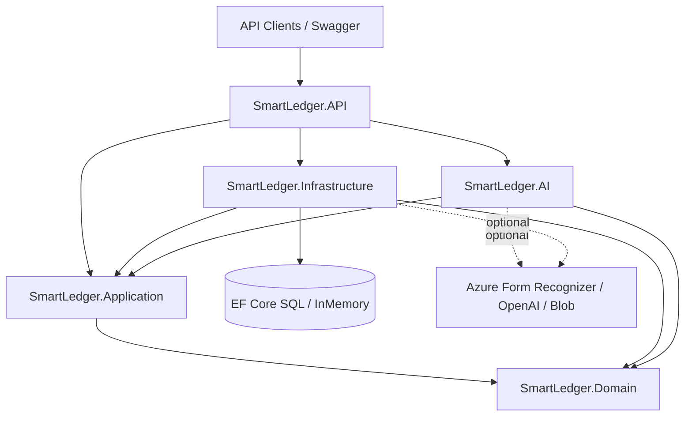

# SmartLedger

**AI-Powered Financial Compliance & Expense Intelligence Platform for Indian SMBs**

SmartLedger helps kirana stores, traders, and small businesses digitize invoice intake, detect spend anomalies, reconcile GST (GSTR-2A vs GSTR-3B), answer finance questions with RAG, and forecast cash flow — without requiring Azure AI credentials for local demos.

## Live demo

| | |
|---|---|
| **API / Swagger** | https://smartledger-api-deelan.azurewebsites.net/swagger |
| **Demo login** | `demo@smartledger.local` / `Demo@12345` |

## Problem

Indian SMBs drown in paper invoices, miss GST mismatches, and lack cash-flow visibility. Accountants spend hours on data entry; owners discover tax issues too late. SmartLedger turns invoices into structured, queryable, compliance-ready data in seconds.

## Features

- **Invoice OCR / Document Intelligence** — Azure Form Recognizer with realistic mock extraction when keys are absent
- **Anomaly detection** — statistical 3× category average / z-score flags (ML.NET-ready)
- **GST reconciliation** — import GSTR-2A / GSTR-3B entries and detect mismatches
- **Financial Q&A (RAG)** — embeddings + vector search + OpenAI (or keyword mock)
- **Cash-flow forecast** — 30 / 60 / 90-day moving-average style projections
- **Multi-tenant JWT auth** — tenant isolation via `tenant_id` claim + EF query filters
- **Hangfire** — background GST report job stub (MemoryStorage for local demo)

## Architecture



| Layer | Responsibility |
|-------|----------------|
| **Domain** | Entities, value objects, repository & AI contracts |
| **Application** | MediatR commands/queries, FluentValidation, DTOs |
| **Infrastructure** | EF Core, Identity, JWT, Hangfire, cache, GST recon, blob storage |
| **AI** | Document Intelligence, OpenAI, embeddings, RAG, anomaly, cash-flow, vector store |
| **API** | Controllers, middleware, Swagger, seeding |

## Local run

Prerequisites: [.NET 8 SDK](https://dotnet.microsoft.com/download/dotnet/8.0)

```bash
dotnet restore SmartLedger.sln
dotnet build SmartLedger.sln
dotnet run --project SmartLedger.API
```

Open Swagger at `https://localhost:7xxx/swagger` (see `launchSettings.json`).

**Demo credentials** (seeded when `UseInMemoryDatabase=true`):

| Field | Value |
|-------|-------|
| Email | `demo@smartledger.local` |
| Password | `Demo@12345` |
| Tenant | Demo Kirana Store |

## API examples

```bash
# Register
curl -s -X POST https://localhost:7001/api/auth/register \
  -H "Content-Type: application/json" \
  -d '{"businessName":"My Kirana","ownerEmail":"me@shop.in","password":"Secret123!","gstin":"29AABCD1234G1Z7"}'

# Login
TOKEN=$(curl -s -X POST https://localhost:7001/api/auth/login \
  -H "Content-Type: application/json" \
  -d '{"email":"demo@smartledger.local","password":"Demo@12345"}' | jq -r .accessToken)

# Upload invoice
curl -s -X POST https://localhost:7001/api/invoices/upload \
  -H "Authorization: Bearer $TOKEN" \
  -F "file=@./sample-reliance-invoice.pdf"

# List invoices
curl -s https://localhost:7001/api/invoices -H "Authorization: Bearer $TOKEN"

# Ask finance question
curl -s -X POST https://localhost:7001/api/financial/ask \
  -H "Authorization: Bearer $TOKEN" -H "Content-Type: application/json" \
  -d '{"question":"What was my top inventory spend?"}'

# GST reconcile
curl -s -X POST https://localhost:7001/api/gst/reconcile \
  -H "Authorization: Bearer $TOKEN" -H "Content-Type: application/json" \
  -d '{"period":"2026-01"}'

# Cash-flow forecast
curl -s "https://localhost:7001/api/cashflow/forecast?horizonDays=30" \
  -H "Authorization: Bearer $TOKEN"

# Dashboard
curl -s https://localhost:7001/api/dashboard/summary -H "Authorization: Bearer $TOKEN"
```

Hangfire dashboard: `/hangfire`

## Configuration / environment variables

| Key | Description |
|-----|-------------|
| `UseInMemoryDatabase` | `true` for local demo (default) |
| `ConnectionStrings__DefaultConnection` | SQL Server connection |
| `ConnectionStrings__Redis` | Optional Redis for cache |
| `Jwt__Secret` | HMAC secret (≥32 chars) |
| `Jwt__Issuer` / `Jwt__Audience` | Token issuer/audience |
| `Azure__FormRecognizerEndpoint` / `Azure__FormRecognizerKey` | Document Intelligence |
| `Azure__OpenAIEndpoint` / `Azure__OpenAIKey` | Azure OpenAI |
| `Azure__OpenAIDeployment` / `Azure__EmbeddingDeployment` | Model deployments |
| `Azure__BlobConnectionString` / `Azure__BlobContainer` | Invoice blob storage |

When Azure keys are empty, SmartLedger uses **mock Document Intelligence**, **hash embeddings**, and **keyword OpenAI completions** so demos still work offline.

## Docker

```bash
docker build -t smartledger-api .
docker run -p 8080:8080 -e UseInMemoryDatabase=true smartledger-api
```

## Azure deploy

1. Push image to GHCR via `.github/workflows/ci-cd.yml` on `main`.
2. Create Azure Container Apps (or App Service) and point to the GHCR image.
3. Set SQL connection string, JWT secret, and Azure AI keys as app settings.
4. Uncomment the Azure deploy steps in the workflow and add secrets: `AZURE_CREDENTIALS`, `AZURE_CONTAINER_APP_NAME`, `AZURE_RESOURCE_GROUP`.

## Tests

```bash
dotnet test SmartLedger.sln
```

Coverage includes Domain value objects/entities, Application handlers (Moq), and AnomalyDetector.

## Resume bullets

- Built a multi-tenant ASP.NET Core 8 Clean Architecture platform for Indian SMB invoice intelligence and GST compliance.
- Implemented Document Intelligence + RAG financial Q&A with Azure AI and fully offline mock providers for demos.
- Designed statistical anomaly detection, cash-flow forecasting, and GSTR-2A/3B reconciliation with Hangfire jobs and JWT isolation.
- Delivered Dockerized CI/CD (GitHub Actions → GHCR) with InMemory EF demo seeding for zero-friction local runs.

## License

MIT — built as a portfolio / production-ready starter for SmartLedger.
